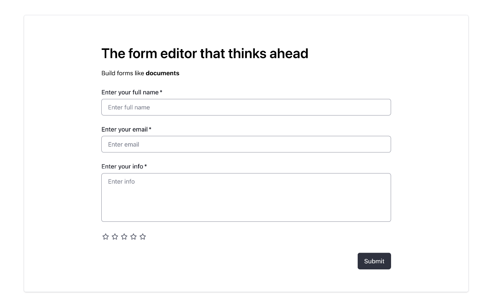

<p align="center">
  <a href="#" target="_blank">
    
  </a>
</p>

# Kameo

Kameo is a toolkit for creating and rendering interactive web forms within rich text content, based on ProseMirror.

## Screenshot

<p align="center">
  
</p>

## Features
- **Create and render web forms** - Build interactive forms within rich text content
- **Import/export forms** - Save and load forms as JSON
- **Dynamic form creation** - Build forms programmatically with commands
- **Rich text editing capabilities** - Can be used as a rich text editor
- **Extensible and customizable** - Create your own custom extensions and form fields
- **Framework agnostic** - Works seamlessly across different frontend frameworks
- **More to come** - The project is actively evolving with new features on the way

## Installation

```bash
npm install @kameo/core @kameo/pm @kameo/starter-kit @kameo/form-kit
npm install @kameo/toolbar-form-fields
```

**IMPORTANT**: Kameo is currently in active development and should not be used in production. During this early phase, npm packages will not strictly follow semantic versioning and will be published infrequently. For now, we recommend experimenting with Kameo in development environments only. You can clone the repository and use the development setup to try out the latest features.

To get started with development env, follow these steps:

```bash
git clone git@github.com:kameojs/kameo.git
cd kameo
npm install && npm run build
cd dev-playground
npm install && npm run start
```

Kameo also uses Web Awesome component library for which an npm package is not available yet. For now, we're getting access to Web Awesome through a temporary CDN (check out "dev playground"). Once npm package is available, more information will be provided on how to configure it for a project.

```html
<link rel="stylesheet" href="https://early.webawesome.com/webawesome@3.0.0-alpha.13/dist/styles/themes/default.css" />
<script type="module" src="https://early.webawesome.com/webawesome@3.0.0-alpha.13/dist/webawesome.loader.js"></script>

<script type="module">
  // Note: autoloader does not work if wa component is inside another lit component.
  import 'https://early.webawesome.com/webawesome@3.0.0-alpha.13/dist/components/input/input.js';
  import 'https://early.webawesome.com/webawesome@3.0.0-alpha.13/dist/components/select/select.js';
  import 'https://early.webawesome.com/webawesome@3.0.0-alpha.13/dist/components/checkbox/checkbox.js';
  import 'https://early.webawesome.com/webawesome@3.0.0-alpha.13/dist/components/button/button.js';
</script>
```

## Quick start

```javascript
import '@kameo/core/style/theme.css';
import { Kameo } from '@kameo/core';
import { StarterKit } from '@kameo/starter-kit';
import { FormKit } from '@kameo/form-kit';
import { ToolbarFormFields, formFields } from '@kameo/toolbar-form-fields';

const kameo = new Kameo({
  element: document.querySelector('#kameo'),
  extensions: [
    StarterKit,
    FormKit,
  ],
  documentMode: 'edit',
});

kameo.on('submit', (event) => {
  console.log(`on 'submit' event`, { event, formData: event.formData });

  event.setSubmitResult({
    success: true,
    message: 'Form is submitted',
  });
});

kameo.on('submitted', (event) => {
  console.log(`on 'submitted' event`, { event });
});

// Create toolbar with fields.
const toolbar = document.createElement('km-toolbar-form-fields');
toolbar.fields = formFields;
document.querySelector('#kameo-toolbar').append(toolbar);
```

Kameo is built on top of Tiptap (core), a powerful editor framework for the web. To better understand how to work with Kameo, we recommend familiarizing yourself with the Tiptap API documentation:

- [Tiptap Editor API](https://next.tiptap.dev/docs/editor/api/editor)
- [Core concepts](https://next.tiptap.dev/docs/editor/core-concepts/introduction)
- [Custom extensions](https://next.tiptap.dev/docs/editor/extensions/custom-extensions)

## Tech Stack

Kameo is built on the following stack:
- ProseMirror, Tiptap (core)
- Lit, Web Components, Web Awesome

## Todo

- [ ] Slash menu (Notion-style)
- [ ] Form validation
- [ ] More field types

## License

The MIT License (MIT). Please see [License](LICENSE) for more information.
